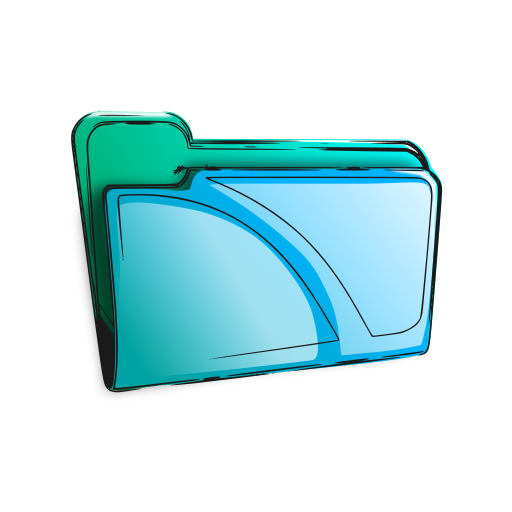

# Electron-Notes

Welcome to ELectron Notes
available on Linux Desktops and downloadable from the snap store.

This notes taking application is simple sleek and a fun way to handle your notes and
comes with a brother [mobile application](https://github.com/RyanLarge13/Native-Notes/) where you can manage and synchronize your notes cross platform.

## Tech

This application was built with Vite Electron allowing you to write up an electron app using the great features of React

## Platforms

Right now Notes is only available on Linux distributions from the snap store.

1. Linux: [download](https://snapcraft.io/web-notes/)
